Au cours du cycle de vie d'un KoomBook, il est possible que vous ayez à remplacer la batterie interne de l'appareil. Veuillez suivre les étapes suivantes afin de remplacer le composant en toute sécurité

## Ouvrir le boitier de l'appareil

* Retirer les 4 vis présentes sous le boitier à l'aide d'un tournevis cruciforme 

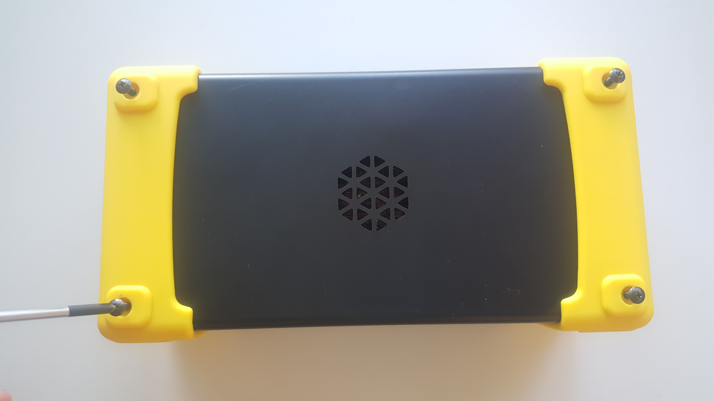

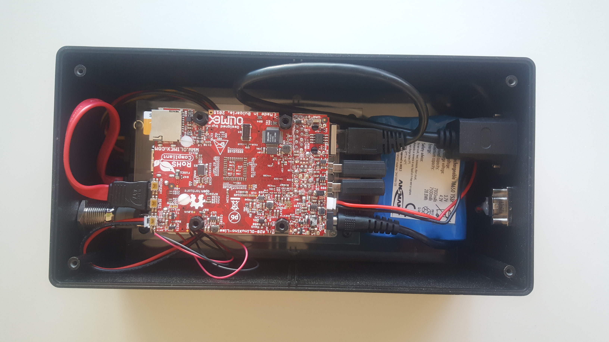

L'intérieur du boitier devrait ressembler à quelque chose comme cela.

## Retirer le cable d'extension RJ45

A l'aide d'un tournevis cruciforme, retirer les 2 vis de l'embase RJ45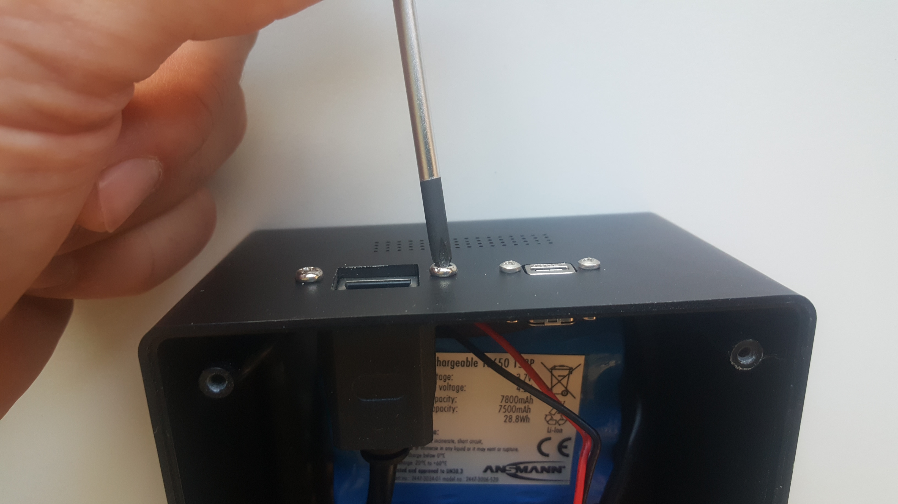

> > > > > Pour plus de facilité vous pouvez également retirer le connecteur RJ45 de la carte mère (plaque rouge).

Attention, pour retirer ce connecteur vous devrez placer vos doigts comme indiqué sur la photo ci-dessous, index dessous et pouce au dessus. Vous pourrez sentir une petite bosse sur le connecteur où vous devrez appuyer avant de tirer/retirez ce dernier. 

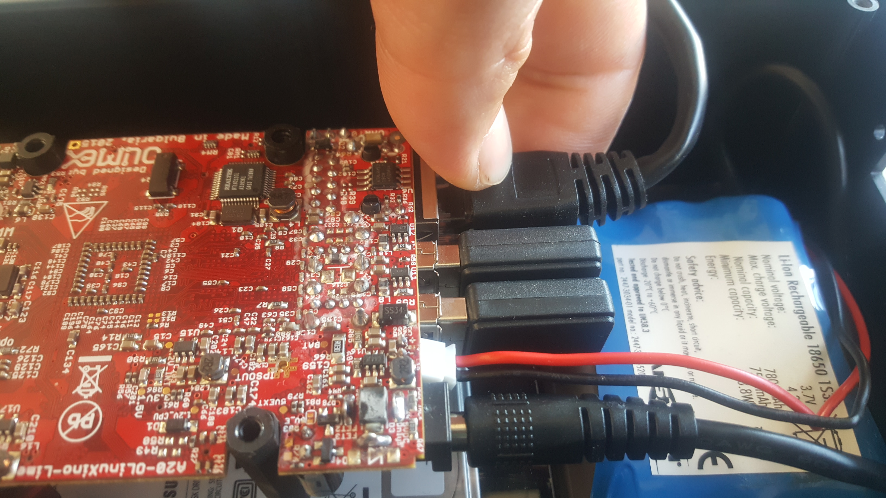

## Retirer le câble d'alimentation 

Tirez vers l'arrière le câble d'alimentation général afin de l'extraire de son embase 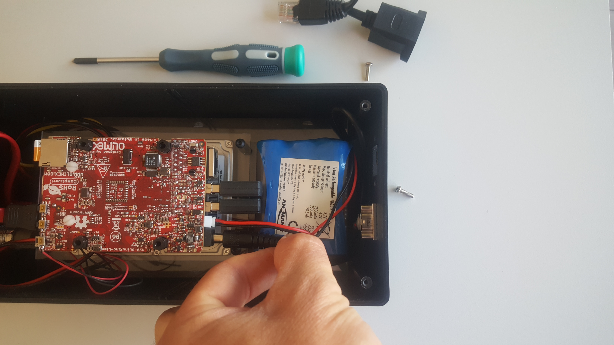

## Retirer le câble de la batterie 

Saisir le fil rouge et noir du câble d'alimentation de la batterie et tirer doucement vers l'arrière. Ce dernier devrait se déconnecter dans la foulée.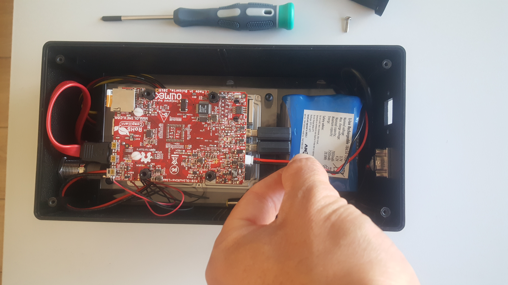

> > > > Ne pas enlever les 2 antennes wifi connecter en USB. Si vous devriez le faire, repérez bien l'emplacement des 2 antennes, c'est à dire, sur quel emplacement USB va la première antenne et sur quel emplacement USB va la seconde. Dans le cas où ces dernières serait inversé, le hotspot wifi du KoomBook ne sera plus en mesure de fonctionner.

## Retirer la batterie défectueuse 

Placer votre index et votre pouce à l'arrière de la batterie (c'est à dire du côté où se trouve les ouvertures sur le boitier) et soulever doucement afin de la décrocher des bandes velcro.

> > > > > La batterie étant maintenu par des bandes velcro, il se peut que cette dernière soit difficile à retirer. Doucement tirer afin que les 2 bandes velcro se désolidarisent.

> > > > Faites attention en retirant la batterie que cette dernière ne vienne pas heurter les 2 antennes wifi connecté en USB à la carte mère.

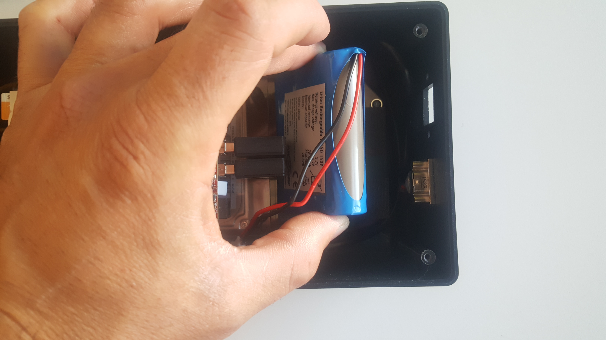

Retirez les bandes velcro présente dans le fond du boitier afin de les remplacer par les nouvelles fournit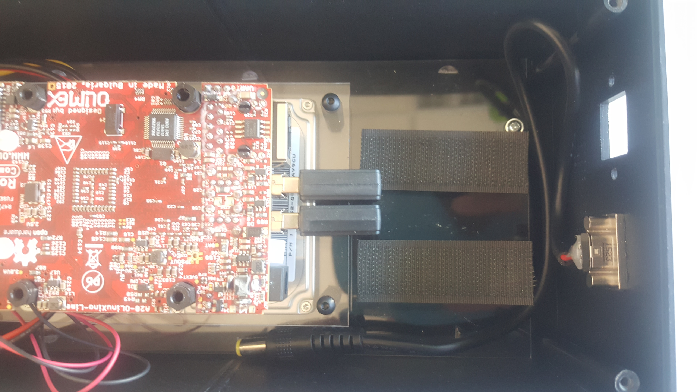

## Préparer la nouvelle batterie 

La batterie est livrée avec 2 bandes velcro collé au dos de cette dernière. Avant de la placer dans le fond du boitier, veillez à retirer les 2 protections en plastiques.

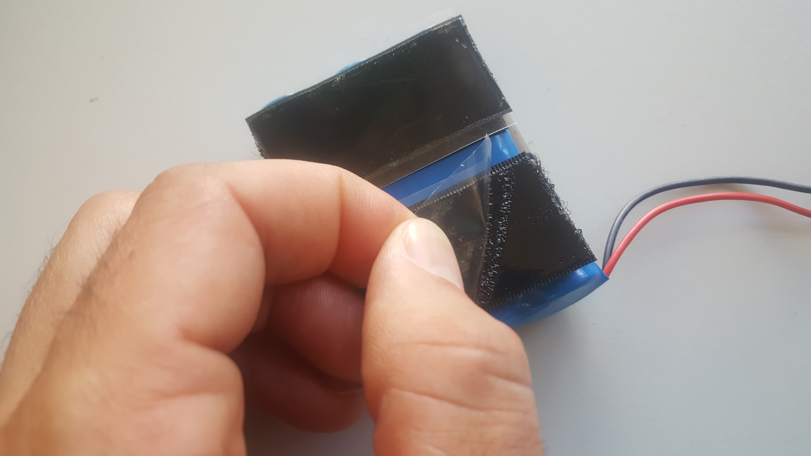

## Mettre en place la nouvelle batterie

Insérez la batterie comme présenté dans les photos suivantes.

> > > > > Ne pas oublier de retirer les protections en plastique des bandes velcro

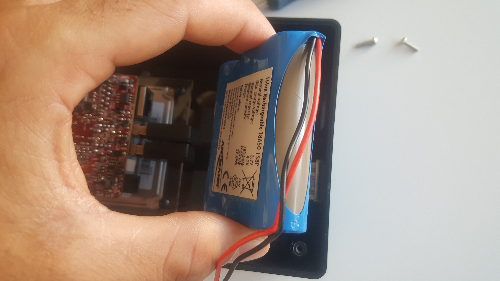

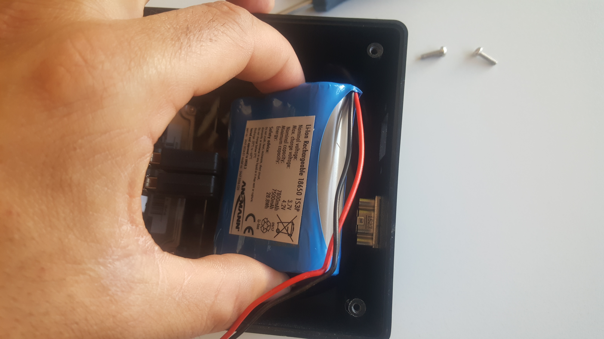

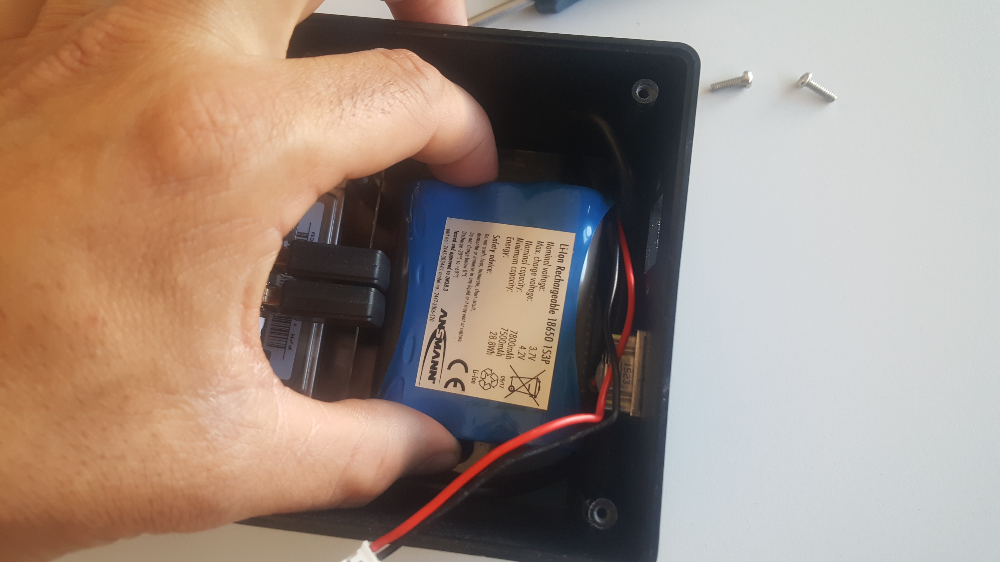

> > > > Bien appuyer sur le dessus de la batterie pour que les bandes auto-collantes adhère au plastique

Retirez la batterie comme vous l'avez fait avec la batterie défectueuse, veillez à ce que les bandes velcro reste bien coller au fond du boitier. Appuyer ensuite sur ces 2 bandes afin de bien les coller.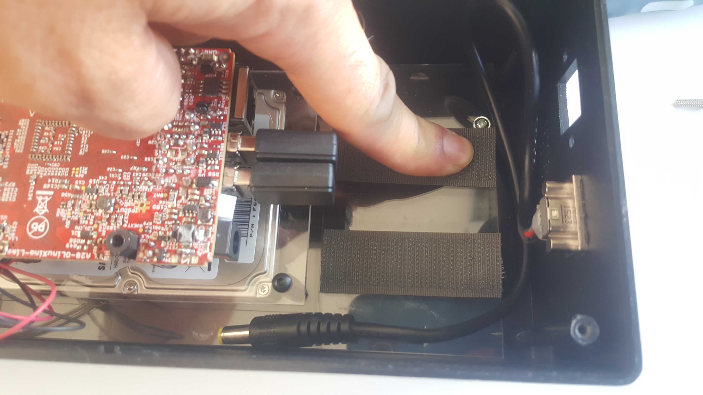

## Connecter la batterie à la carte mère

> > > > Le connecteur de la batterie possède un détrompeur, il ne s'insére que dans un sens spécifique

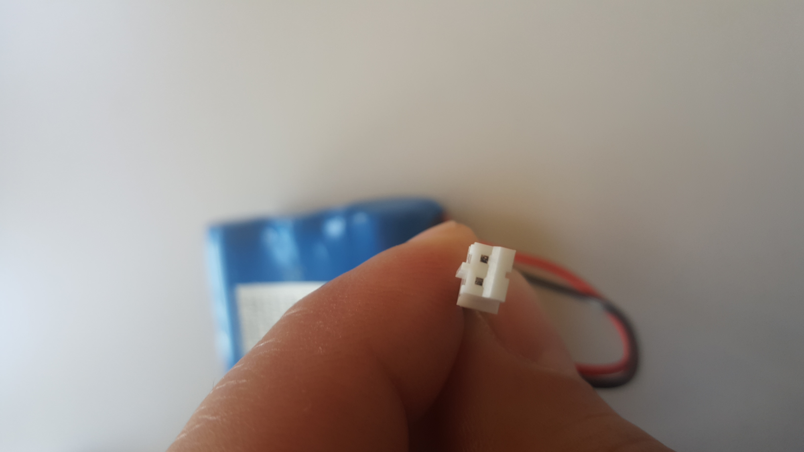

Pré-positionner le connecteur de la batterie dans le connecteur de la carte mère.

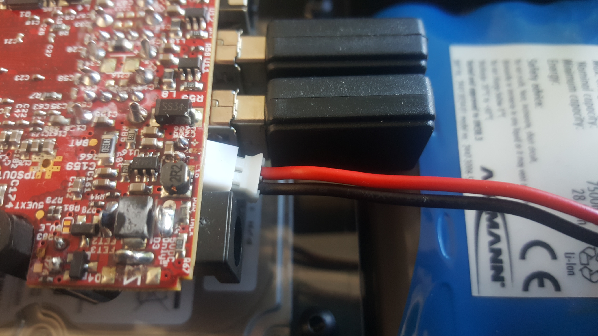

Une fois correctement pré-inséré, finalisez la connexion de la batterie à la carte mère en poussant le connecteur mâle dans le connecteur femelle avec votre ongle

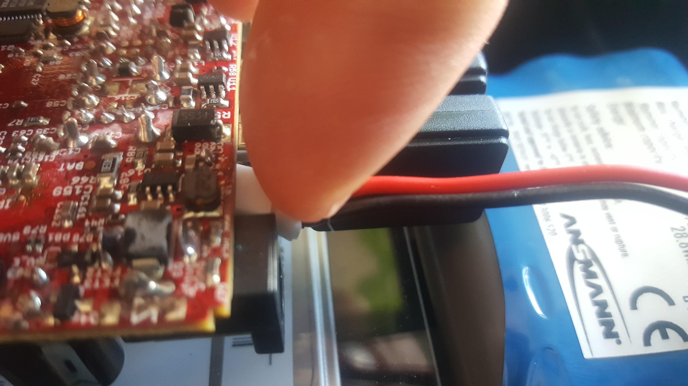

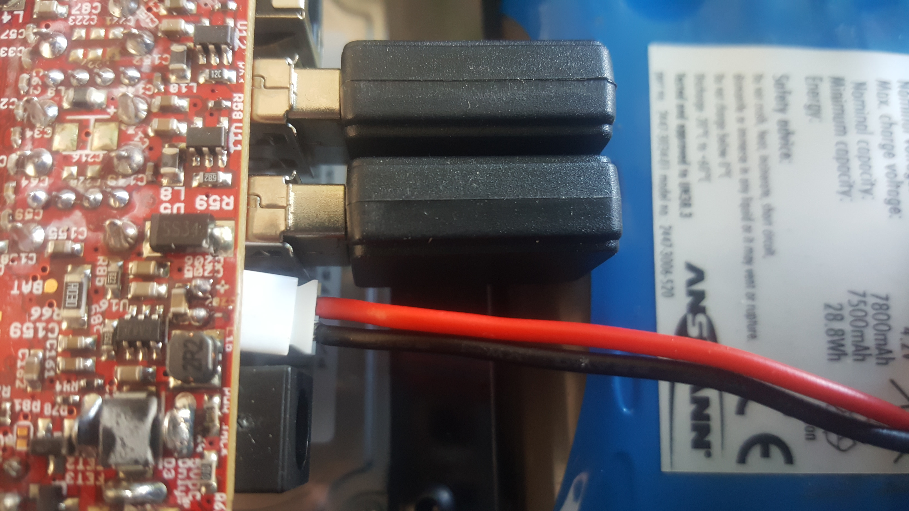

## Connecter le reste des composants

* Connecter le câble RJ45 à la carte mère
* Connecter le câble d'alimentation à la carte mère
* Visser le câble RJ45 au boitier à l'aide d'un tournevis cruciforme et des 2 vis
* Placer le couvercle sur le dessus du boitier
* Re-visser les 4 vis du couvercle