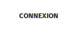
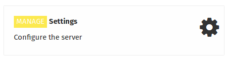
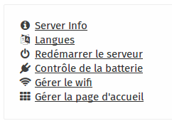

#Comment connaître le taux de charge de mon koombook?

Vous pouvez contrôler l'état et la charge de la batterie depuis la zone d'administration d'IdeasCube. 

Connectez-vous à l'aide de votre identifiant et mode passe : 

Lien **connexion** en haut à droite de la page

Une fois connecté, rendez-vous sur la page d'accueil et cliquez sur le lien suivant 

Une fois dans la zone d'administration, cliquez sur le lien **Contrôle de la batterie**

