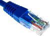

**You can connect to the internet two different ways**

* Via **Ethernet**

* Or via **WiFi**.  To connect using WiFi, see "[WiFi management](https://bsf.gitbooks.io/manuel-ideascube/content/fr/gestion_du_wifi.html)" for more information.

**We prefer updating using Ethernet**, which is more secure and stable, and has a higher output. 

Connecting the KoomBook to the internet using a WiFi hotspot from a smartphone is strongly discouraged.  Even if you don't expect there to be any important updates, you may quickly use up your 3G data since you can't control what is transmitted to and from the KoomBook.

Sometimes, if the internet connection is poor or unstable, you may want to wait until nighttime, when less people are using the internet and there can be a stronger connection, to update the KoomBook.
