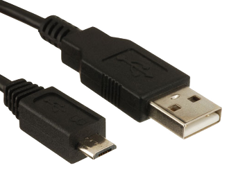

# Comment recharger la batterie du KoomBook ?

## Avec le chargeur USB 220/110V -&gt; 5V

Le KoomBook se recharge à l'aide d'un chargeur USB 5V / 2A. Celui fournit avec le KoomBook correspond à cela

Il faut également un câble USB type A vers micro-usb de ce type

Il faut ensuite enficher la prise micro-usb à l'arrière du KoomBook \(prise gauche\) dans la prise micro-usb femelle, **ATTENTION** cette dernière à un sens, ne pas trop forcer.

## Avec le chargeur chargeur USB multiport

Le chargeur USB fournit dans les flightcase permet la recharge de multiple appareils simultanément

Connectez simplement le câble USB sur le chargeur USB et l'autre extrémité sur le KoomBook

## Avec un panneau solaire et sa batterie

Référez vous à la page [Le KoomBook peut-il fonctionner à l'aide d'un kit solaire ?](le-koombook-peut-il-fonctionner-a-laide-dun-kit-solaire/default.md) pour plus d'informations
