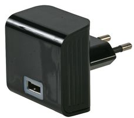
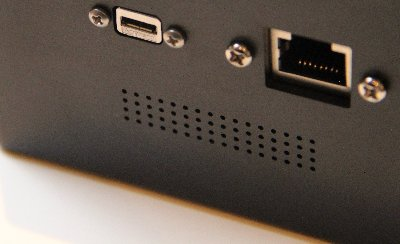
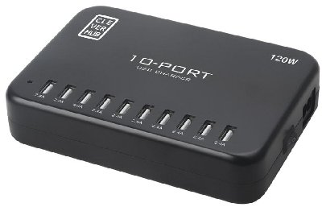

There are several ways to recharge the battery of your KoomBook

## With a USB 220/110-V -&gt; 5-V Charger

The KoomBook can be charged by using a USB 5-V / 2-A charger.  There is one provided with the KoomBook:

You must also have a USB cable like this one:

Put the micro USB into the port on the back of the KoomBook (the port on the left below).  **WARNING** Make sure the USB is oriented correctly.  Don't try to force it into the port.

## With the Multiport USB Charger

The USB charger provided in the flightcase can recharge several devices at once.

Simply connect the USB cable to the USB charger, and connect the other end to the micro USB port of the KoomBook.

## With a Solar Panel and its Battery

For more information, see this page: [Can the KoomBook work with a solar kit?](../le-koombook-peut-il-fonctionner-a-laide-dun-kit-solaire) 
