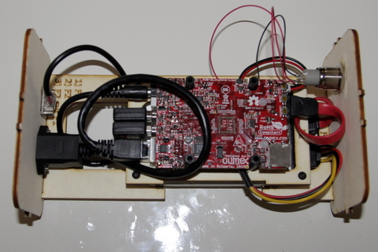

# Connecter les cables
1. Commncez par la fiche ronde qui est à enfoncer juste à droite du petit connecteur blanc  
  
2. Poursuivez avec la fiche Ethernet  
  
3. Puis les 2 dongles Wifi à insérer dans les 2 connecteurs USB  
  
4. Vu final sur avec les câbles connectés 
  
