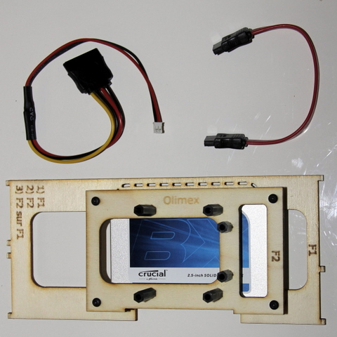
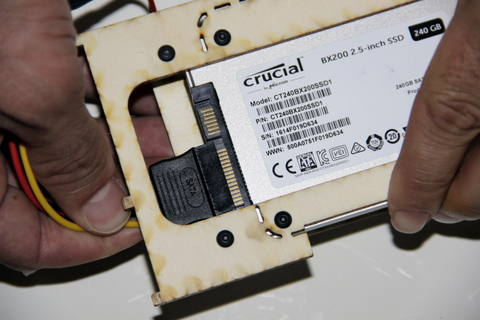
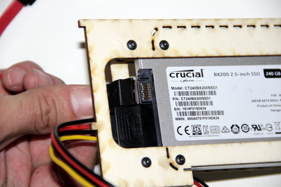

# Connecter les câbles SATA et d'alimentation au disque dur

## Matériel nécessaire

* Câble SATA \(rouge\)
* Câble d'alimentation \(4 fils : 2 noir, 1 rouge et 1 jaune\)
* Assemblage de la platine F1 et F2

## Assemblage

1. Prenez le câble d'alimentation \(connecteur le plus large\) et positionez le face au disque dur. 
   **Attention** La connectique du câble et du disque possède un détrompeur. Bien vérifier avant de l'enfoncer complétement.  
     
2. Une fois que vous avez trouvé le bon sens enfoncé le...  
     
   complètement  
     
3. Répétez l'opération avec le câble SATA rouge  
     
     
      
4. Le câble d'alimentation et SATA en position final  
     
5. Vu du dessus  
   

