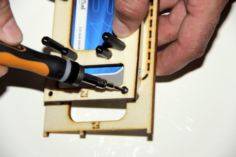
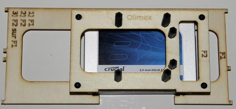

# Fixer la platine F2 sur la platine F1

## Matériel nécessaire 
* Platine F1
* Platine F2
* 4 vis métal à tête plates M3x5 (ø3mm, longueur 5mm)  

## Assemblage
1. Positioner la platine F2 au dessus de la platine F1. Veillez à bienn faire attention à avoir la gravure **F1** et **F2** du même côté.  
   
2. Fixer les 4 coins de la platine F2 à l'aide des vis métal   
    
  
