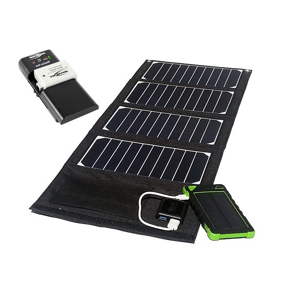
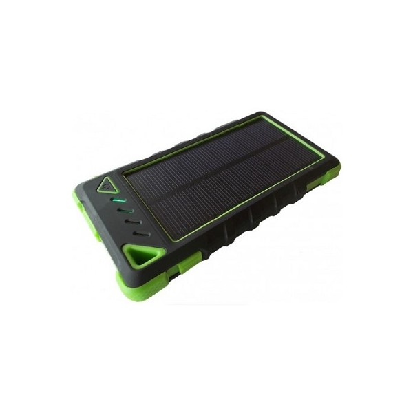
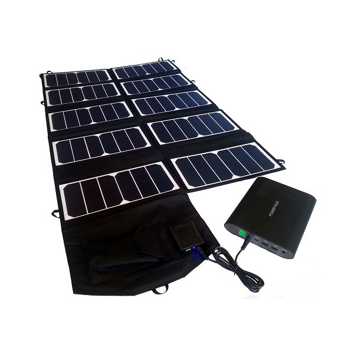
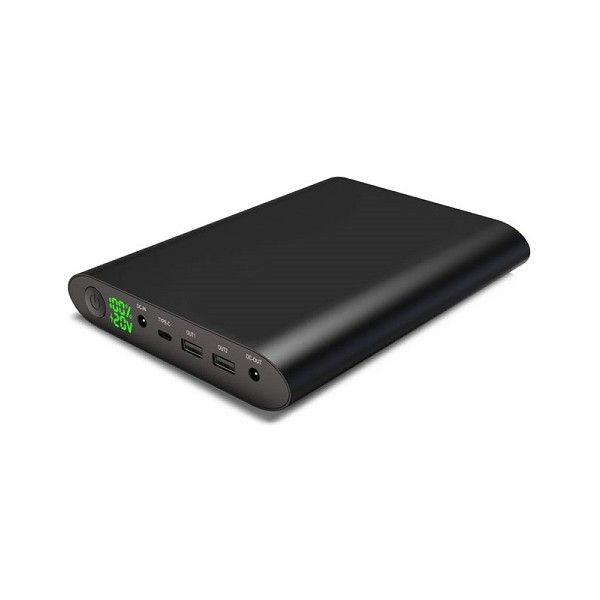
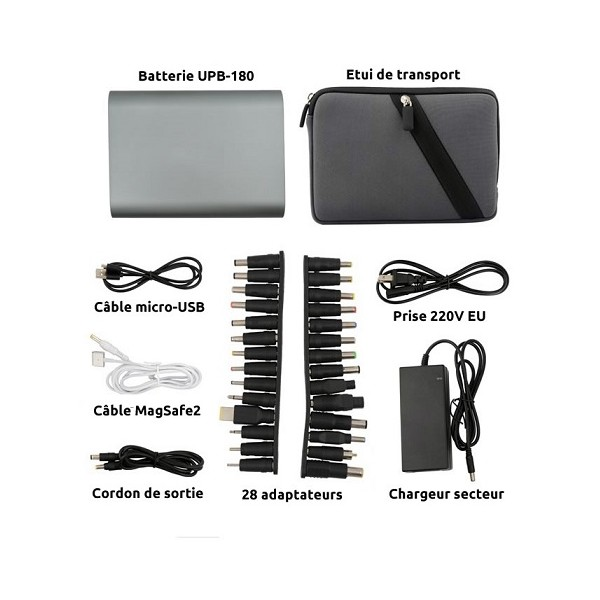

# Le KoomBook peut-il fonctionner à l'aide d'un kit solaire ?

Dans certains cas vous pouvez être amené à utiliser un kit solaire comprenant un panneau solaire et une batterie

|  | Kit 20w | Kit 65w |
| :---: | :--- | :--- |
| Possibilité de recharger le pack batterie via secteur ? | oui mais il faut un adapteur transformateur 230V alternatif vers USB 5V \(type bloc chargeur téléphone\) | oui |
| Temps de rechargement du pack batterie via secteur | approximativement 6h _\(à confirmer\)_ | 6h |
| Temps de rechargement via panneaux solaires | 5h15 \(1h sous soleil plein mais avec nuages\) | X min |
| Peut-on recharger les batteries et utiliser EN MEME TEMPS ces dernières pour recharger un KoomBook/Tablettes ? | Non | Non |
| Combien d'appareils peuvent être rechargés jusqu'à 100% en même temps ? | 1 théoriquement | X |
| Combien d'appareils peuvent être rechargés jusqu'à 50% en même temps ? | 2 théoriquement | X |
| Tension maximal disponible en sortie du panneau solaire ? | 5.5V | 19V |
| Courant maximal disponible en sortie du panneau solaire ? | 2.1A mais la tension descend à 2V \(plusieurs possibilité\) | A \(plusieurs possibilité\) |
| Tension maximal disponible en sortie du pack batterie ? | 5.2V chargée à 100 % | 5.3V en sortie USB et 20V en DC OUT \(plusieurs possibilité\) |
| Courant maximal disponible en sortie du pack batterie ? | 1.6A sur 1 port USB | 4A sous 20V |

### Kit solaire 20w et sa batterie de 8Ah

  

### Kit solaire 65w et sa batterie de 50Ah

