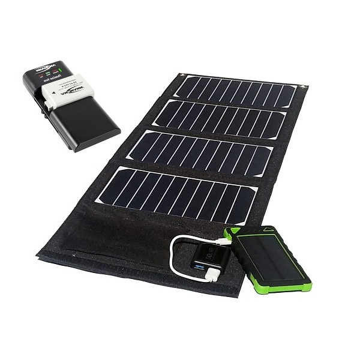
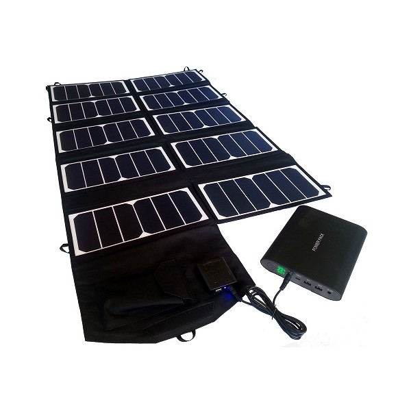
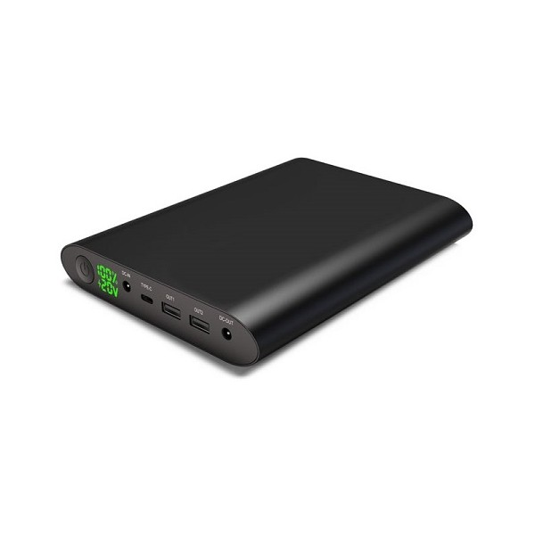

In certain cases, you can use a solar kit made up of a solar panel and battery.

|  | 20w Kit | 65w Kit |
| :---: | :--- | :--- |
| Can I recharge the battery from an outlet? | Yes, but you need a 230V ac adapter to USB 5V (like a telephone charger) | Yes |
| Charging time through main power | approximately 6h _\(to be confirmed\)_ | 6h |
| Charging time through solar panels | 5h15 \(less under full sunlight\) | X min |
| Can I charge the battery while also charging the KoomBook or tablets? | No | No |
| How many devices can be fully charged at once? | Theoretically 1 | X |
| How many devices can be charged half way at once? | Theoretically 2 | X |
| Maximum output from solar panel | 5.5V | 19V |
| Maximum output intensity from solar panel | 2.1A, but power drops quickly | 3A |
| Maximum output from battery back | 5.2V fully charged | 5.3V (USB), 20V DC OUT |
| Maximum output intensity from battery | 1.6A on 1 USB port | 4A under 20V |

### 20w Solar Kit and its 8Ah Battery 

  

### 65w Solar Kit and its 50Ah Battery

