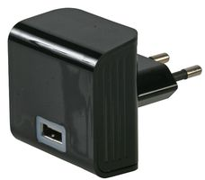

[The 5V 2A USB charger](http://fr.farnell.com/pro-power/mwusb3u-black/alimentation-usb-5v-2-1a-blk-euro/dp/2289559?MER=BN-2289559) provided with the KoomBook is optimal for providing power to the device.  

**Check that the charger is working properly:**

* [ ] Is it in good condition?
* [ ] Are the two pins in good shape? 
* [ ] Once plugged into a socket, is there a blue halo around the USB connector?
* [ ] Test by plugging the USB/micro USB cable into the charger and any device (smartphone, MP3 player, etc...) 

**WARNING: The KoomBook requires a good USB charger.  If you need to replace the one provided, we recomment you get a 5V, 2A one.  Do not plug the KoomBook into your computer's USB port.**

