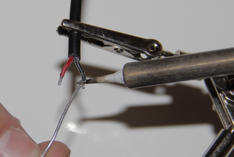
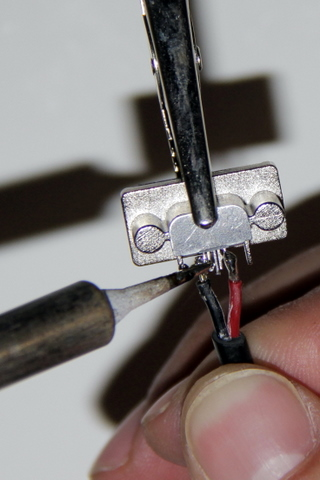

# Souder la prise micro USB

## Matériel nécessaire 
* Prise micro-USB
* Câble noir avec prise ronde
* Pistolet à colle  

**/!\ ATTENTION** Ces opérations sont assez délicates. Manier la  prise micro-usb avec précaution...

## Assemblage 
1. Etamer les fils   
  
2. Souder le câble noir à la prise micro-USB (Il s'agit de souder le fil rouge sur la cosse la plus à droite de la prise et le fil noir sur la cosse la plus à gauche)  
  
3. Poser un point de colle sur les soudures et autour du câble afin de solidariser le tout.   

