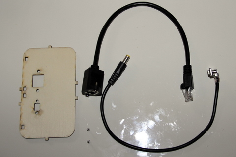
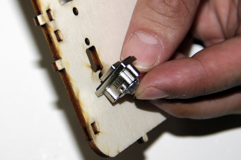

# Monter la façe arrière du boitier
## Matériel nécessaire 
* Prise micro-USB
* Câble noir avec prise ronde
* Prise Ethernet RJ45 montage façade
* Face arrière du boitier
* 2 vis métalique B&F Fastener Supply PMSSS 256 0025 PH

## Assemblage 
1. Positionner la prise micro-usb comme présenté sur la photo. Vous pouvez vous repérer à l'aide des petits détrompeur sur les côtés.  
  
2. Maintenez la prise micro-usb à l'aide de votre indexe et à partir de la face avant insérer la première vis métalique et visser. Repétez l'opération pour la seconde vis  
  
3. Positionez le connecteur Ethernet comme présenté sur la photo  
  
4. Et vissez le tout à l'aide des deux vis fournis  
  
